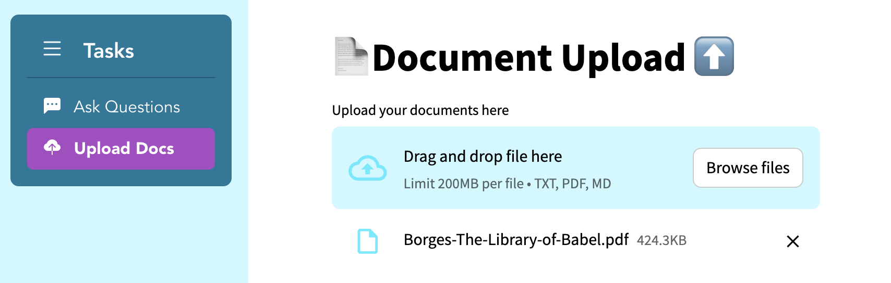
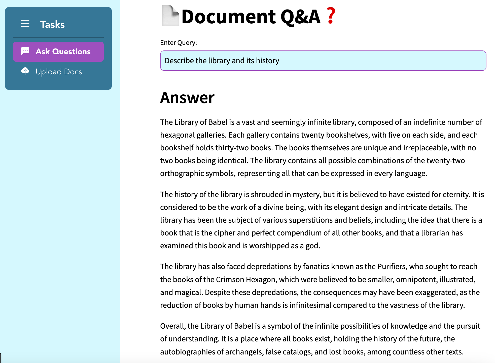

# DoctelliGen
### An AI/LLM Powered Document Query

A web application that allows you to upload documents (pdf, text and md currently) and then use a Large Language Model (LLM) to query the documents and receive relevant answers.

## Example

Document Upload Dialog:



Document Query Dialog:




## Installation 

Create an activate a new Python environment:

```bash
conda create -n pdf-qa python=3.11
conda activate pdf-qa
```

Clone the repo and enter it:

```bash
git clone https://github.com/robert-mcdermott/pdf-qa.git
cd pdf-qa
```

Install the dependencies (install the latest version of poetry if you don't have it):

```
poetry install
```

Run the app:

```
python app.py
```